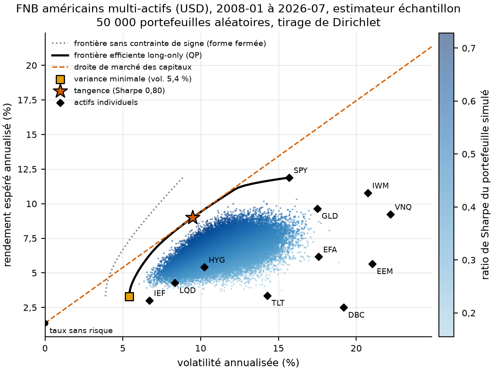
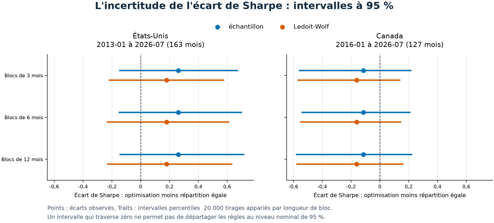

# Mieux répartir son argent entre plusieurs fonds

Comment répartir son argent pour viser un rendement avec moins de variations ? Une frontière efficiente montre les meilleurs compromis calculés sur le passé.

Ce projet la vérifie avec [FinQuant](https://github.com/fmilthaler/FinQuant), puis teste les répartitions sur des mois nouveaux.

**L'optimisation fait mieux aux États-Unis et moins bien au Canada sur les périodes étudiées. L'incertitude reste trop grande pour établir la supériorité d'une règle.**

## Lire la frontière



Chaque point répartit l'argent entre onze fonds négociés en bourse, des paniers achetés comme des actions. À gauche, les rendements varient moins. En haut, leur moyenne est plus élevée.

Le trait foncé donne le portefeuille le moins volatil pour chaque rendement visé. Les cercles verts sont les recalculs de FinQuant. Le cercle violet répartit l'argent également entre les fonds.

La figure décrit janvier 2008 à juillet 2026, sans prévoir l'avenir. La [version canadienne](results/figures/canada/cloud_dirichlet_sample.png) se lit de la même façon.

## Essayer les répartitions sur des mois nouveaux

Chaque mois, le programme choisit les poids avec les 60 mois précédents, puis les applique au mois suivant. Il déduit 0,10 % du montant de chaque achat ou vente, premier achat compris.

Le ratio de Sharpe rapporte le rendement au-delà du placement sans risque à sa variabilité. Plus il est élevé, meilleur est ce compromis sur la période.

| Univers et période du test | Répartition optimisée | Répartition égale | Écart et intervalle approximatif à 95 % |
|---|---:|---:|---:|
| États-Unis, janvier 2013 à juillet 2026 | 0,77 | 0,51 | +0,26 [−0,15 ; +0,70] |
| Canada, janvier 2016 à juillet 2026 | 0,62 | 0,73 | −0,11 [−0,54 ; +0,21] |

Les Sharpe sont après coûts et en devise locale. Les périodes diffèrent, donc on compare les règles au sein de chaque univers. [Résultats américains](results/tables/us/oos_metrics.csv) et [canadiens](results/tables/canada/oos_metrics.csv).

## Mesurer ce qui pourrait venir du hasard

Nous reconstruisons 20 000 histoires en tirant des suites de six mois consécutifs. Les deux règles reçoivent toujours les mêmes mois, ce qui préserve leur comparaison.



Les points donnent l'écart observé et les traits son incertitude. Tous traversent zéro. Les données ne départagent donc pas les règles, sans prouver leur équivalence.

Cette analyse réutilise les rendements déjà obtenus. Elle ne recalcule pas les allocations dans chaque histoire et ne corrige pas le choix préalable des fonds. Les hypothèses sont dans la [méthode d'inférence](docs/INFERENCE.md).

FinQuant contrôle le calcul, pas les prévisions.

## Refaire les calculs

```bash
make setup
make test
make demo
make inference
```

Les tests, la démonstration et l'inférence fonctionnent sans réseau. `make data` puis `make run` reconstruisent les frontières réelles. Une nouvelle collecte peut réviser l'historique.

## Pour aller plus loin

[Méthodes, résultats complets et références](docs/ETUDE_DETAILLEE.md) · [Présentation en PDF](rapport/rapport.pdf) · [Citer le projet](CITATION.cff) · [Licence](LICENSE).

## English summary

Efficient frontiers are checked with FinQuant and tested on subsequent months. Optimization's net Sharpe advantage is positive in the US sample and negative in Canada, but paired block bootstrap intervals include zero in both. This is not evidence that the rules are equivalent.
