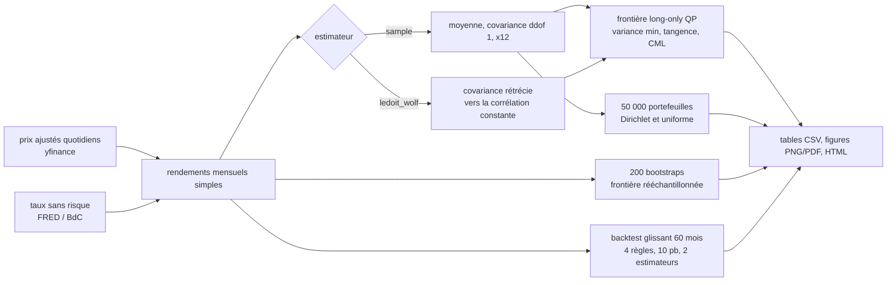
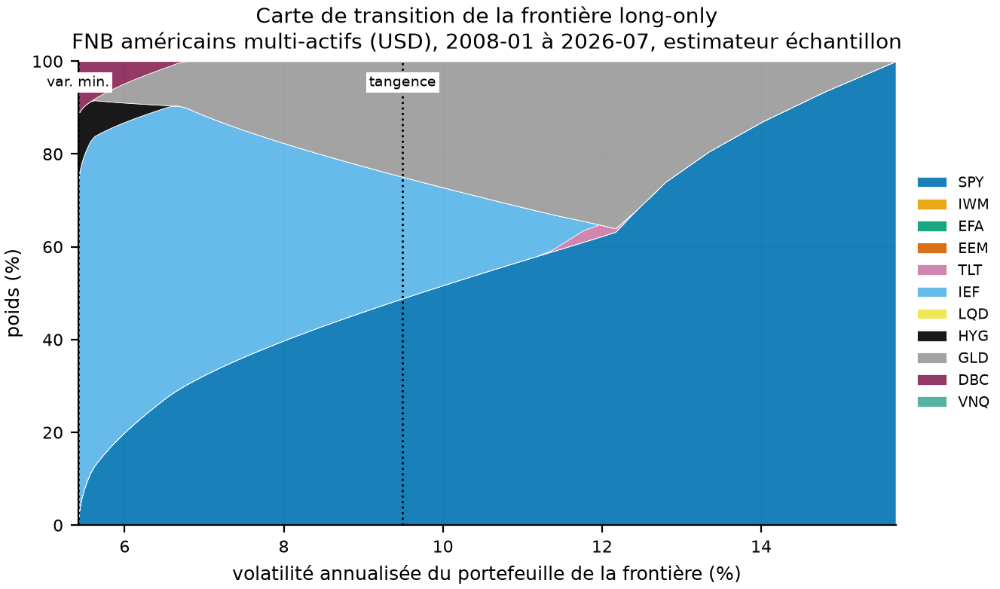
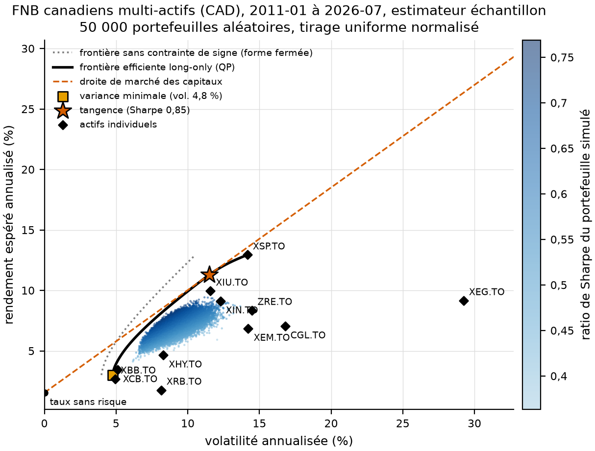
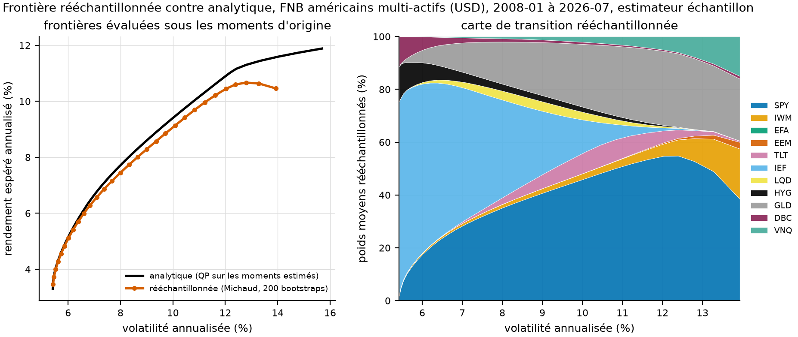
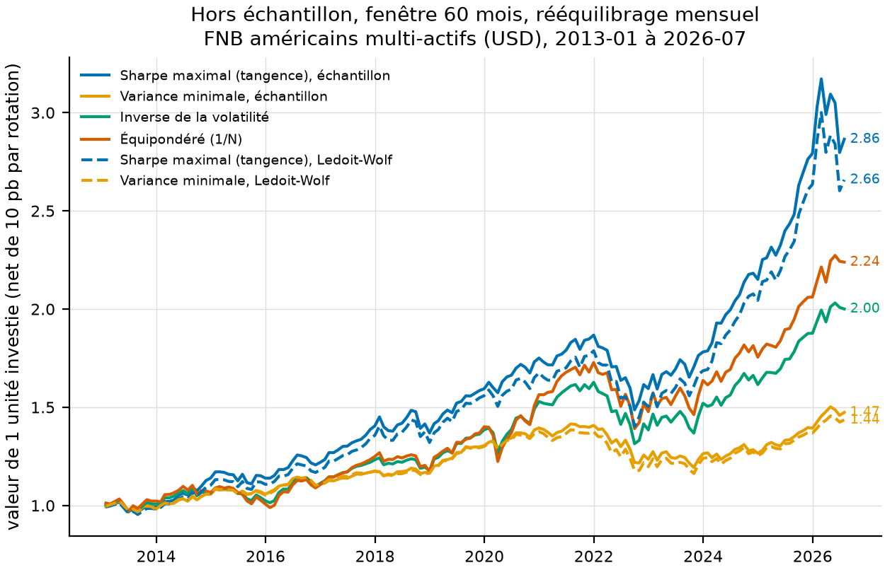
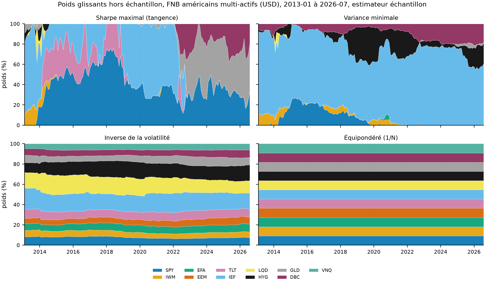

# La frontière efficiente de Markowitz, mesurée : Monte Carlo contre programme quadratique, frontière rééchantillonnée et test hors échantillon contre 1/N

Markowitz (1952) et Sharpe (1964, 1966) appliqués à 11 FNB américains multi-actifs (2008-01 à 2026-07) et à
11 FNB canadiens (2011-01 à 2026-07). S'y ajoutent le rétrécissement de la covariance de Ledoit et Wolf (2004),
la frontière rééchantillonnée de Michaud (1998) et la comparaison hors échantillon à l'équipondéré de DeMiguel,
Garlappi et Uppal (2009).

[](https://github.com/Guilou001/efficient-frontier-mpt/actions/workflows/ci.yml)


**Résultat en une phrase.** Sur 50 000 portefeuilles aléatoires, le meilleur ratio de Sharpe simulé plafonne à
0,73 contre 0,80 pour le portefeuille de tangence calculé par programme quadratique (FNB américains, 2008-2026) ;
hors échantillon, net de 10 points de base par rotation, le portefeuille de Sharpe maximal bat l'équipondéré aux
États-Unis (Sharpe 0,77 contre 0,51, 2013-2026) et perd au Canada (0,62 contre 0,73, 2016-2026).

*English summary.* Modern Portfolio Theory on two ETF universes: 11 US multi-asset ETFs (2008-01 to 2026-07,
223 months) and 11 Canadian ETFs in CAD (2011-01 to 2026-07, 187 months). Long-only efficient frontier by
quadratic programming (cvxpy, Clarabel), closed-form unconstrained frontier (two-fund theorem), minimum-variance,
tangency and capital market line; 50,000 random portfolios per draw (Dirichlet(1) versus uniform-normalised
weights) and why the cloud never reaches the frontier's ends; Ledoit-Wolf constant-correlation shrinkage
(intensity 0.085 US, 0.203 Canada); Michaud's resampled frontier (200 bootstraps); walk-forward backtest
(60-month window, monthly rebalancing, 10 bp one-way costs) of max-Sharpe, min-variance, inverse-vol and 1/N.
Measured: the best simulated Sharpe is 0.73 (US) and 0.82 (Canada) against 0.80 and 0.85 for the tangency
portfolio; out of sample, max-Sharpe beats 1/N in the US (0.77 vs 0.51) and loses in Canada (0.62 vs 0.73);
Ledoit-Wolf inputs do not rescue max-Sharpe (0.69 US, 0.57 Canada). All numbers come from `results/tables/`.


*Figure 1. FNB américains, 2008-01 à 2026-07, moments échantillon. 50 000 portefeuilles long-only tirés d'une
loi Dirichlet(1), colorés par ratio de Sharpe. Frontière long-only (trait noir), frontière sans contrainte de
signe (pointillé gris), portefeuille de variance minimale (carré), portefeuille de tangence (étoile, Sharpe 0,80),
droite de marché des capitaux (tirets), les 11 FNB (losanges). Le nuage reste loin des deux extrémités de la
frontière (section 5.2). Version interactive, survol = poids : `results/figures/us/cloud_interactive_sample.html`.*

## 1. Ce que c'est, ce que ce n'est pas

C'est une mise en œuvre complète et testée de la théorie moderne du portefeuille sur des données publiques,
avec des paquets Python courants (numpy, pandas, scipy, cvxpy, matplotlib, seaborn, plotly, yfinance) et des
résultats mesurés plutôt que racontés. Les paramètres (fenêtre de 60 mois, 10 points de base, graine 123, 50 000
tirages, 200 bootstraps) sont fixés avant l'exécution et ne sont pas ajustés après coup. La partie dans
l'échantillon (sections 5.1 à 5.4) et la partie hors échantillon (section 5.5) sont séparées une fois pour toutes.

Ce n'est pas un conseil d'investissement, ni une étude des rendements futurs. Les frontières sont calculées sur
des moments estimés sur le passé ; la section 5.5 montre ce qu'ils valent une fois sortis de l'échantillon.

## 2. Papiers et éléments répliqués

| Élément | Référence | Fichier produit | Code |
|---|---|---|---|
| Frontière moyenne-variance long-only, variance minimale | Markowitz (1952) | `results/tables/<univers>/frontier_<est>.csv`, `special_portfolios_<est>.csv` | `frontier.py` : `FrontierSolver`, `efficient_frontier` |
| Frontière sans contrainte de signe, théorème des deux fonds | Merton (1972) | colonne `vol_unconstrained` de `frontier_<est>.csv` | `frontier.py` : `closed_form_frontier` |
| Portefeuille de tangence, droite de marché des capitaux, ratio de Sharpe | Sharpe (1964, 1966) | `special_portfolios_<est>.csv` | `frontier.py` : `FrontierSolver.tangency`, `capital_market_line` |
| Rétrécissement vers la corrélation constante | Ledoit et Wolf (2004) | `moments_ledoit_wolf.csv`, `summary_ledoit_wolf.json` (intensité) | `estimation.py` : `ledoit_wolf_constant_correlation` |
| Frontière rééchantillonnée | Michaud (1998) | `resampled_frontier_<est>.csv` | `montecarlo.py` : `resampled_frontier` |
| Comparaison hors échantillon à 1/N | DeMiguel, Garlappi et Uppal (2009) | `oos_metrics.csv`, `oos_returns.csv` | `backtest.py` : `walk_forward` |
| Diversification maximale (portefeuille de référence supplémentaire) | Choueifaty et Coignard (2008) | `special_portfolios_<est>.csv` | `frontier.py` : `FrontierSolver.max_diversification` |

Ce qui n'est pas répliqué : les tableaux chiffrés de ces papiers (autres univers, autres périodes). Le dépôt
applique leurs méthodes à deux univers de FNB et mesure ce qu'elles donnent.

## 3. Données

| | FNB américains | FNB canadiens |
|---|---|---|
| Tickers | SPY, IWM, EFA, EEM, TLT, IEF, LQD, HYG, GLD, DBC, VNQ | XIU.TO, XSP.TO, XIN.TO, XEM.TO, XBB.TO, XCB.TO, XRB.TO, XHY.TO, ZRE.TO, CGL.TO, XEG.TO |
| Classes couvertes | actions É.-U. grandes et petites capitalisations, EAEO, émergents ; Trésor long et intermédiaire, crédit IG et haut rendement ; or, matières premières, FPI | actions canadiennes, É.-U. couvert, EAEO couvert, émergents ; obligations univers, corporatives, à rendement réel, haut rendement couvert ; FPI, or couvert, énergie |
| Rendements mensuels | 2008-01 à 2026-07, 223 mois | 2011-01 à 2026-07, 187 mois |
| Prix | clôtures ajustées quotidiennes Yahoo Finance (yfinance, `auto_adjust=True`), dernier prix du mois | idem |
| Taux sans risque | bons du Trésor 3 mois, FRED `TB3MS` (mensuel), moyenne 1,38 % par an sur la période | bons du Trésor 3 mois, Banque du Canada `TB.CDN.90D.MID` (quotidien, moyenne mensuelle), 1,54 % par an |
| Devise | USD | CAD (XSP, XIN, XHY et CGL sont couverts contre le dollar américain) |

Choix et abandons, vérifiés sur Yahoo Finance le 2026-08-23 (`data/raw/manifest.json`) : XEF.TO (MSCI EAEO IMI)
commence le 2013-04-15, remplacé par XIN.TO (EAEO couvert, 2002) ; XBM.TO (matériaux) commence le 2012-01-24,
écarté ; XEG.TO (énergie, 2001) retenu comme secteur canadien. CGL.TO commence le 2010-10-04 et fixe le début de
l'univers canadien à 2011-01. L'univers américain démarre en 2008-01 parce que HYG (2007-04) est le dernier venu.

Les prix ne sont pas versionnés (conditions d'utilisation de Yahoo Finance) : `make data` les télécharge dans
`data/raw/` (parquet) avec un manifeste (date, tickers, bornes, sha256). Les séries FRED et Banque du Canada sont
publiques et téléchargées sans clé. Seules les sorties dérivées (tables CSV, figures) sont dans le dépôt.

## 4. Méthode



Choix qui comptent :

1. Moments annualisés par simple produit par 12 (moyenne arithmétique, covariance), sans correction
   d'autocorrélation. Le taux sans risque de la frontière est la moyenne des taux mensuels de la période,
   composée sur l'année.
2. Frontière long-only par programme quadratique (cvxpy, solveur Clarabel), compilé une fois avec des
   paramètres et résolu pour 60 cibles de rendement entre le minimum de variance et l'actif le plus rentable.
   La tangence long-only passe par la transformation de Charnes-Cooper (minimiser y'Σy sous (μ - r)'y = 1,
   y ≥ 0, puis normaliser), qui en fait un QP exact plutôt qu'une recherche non convexe.
3. Deux tirages de poids pour le Monte Carlo : Dirichlet(1, …, 1), loi uniforme sur le simplexe, et vecteur
   uniforme normalisé par sa somme, qui se concentre autour de 1/N. Les deux sont vectorisés (un produit
   matriciel et un `einsum`, aucune boucle sur les portefeuilles).
4. Frontière rééchantillonnée : 200 bootstraps i.i.d. des mois, ré-estimation, frontière à 30 rangs, moyenne
   des poids par rang, statistiques évaluées sous les moments d'origine.
5. Backtest glissant : à chaque fin de mois, moments estimés sur les 60 mois précédents, poids cibles tenus le
   mois suivant, dérive des poids entre deux rééquilibrages, coût de 10 points de base par unité de rotation
   aller simple. Quatre règles : Sharpe maximal, variance minimale, inverse de la volatilité, 1/N ; les deux
   premières sous moments échantillon et sous Ledoit-Wolf. TCAC en années civiles (jours / 365,25), Sharpe sur
   rendements excédentaires mensuels × √12, perte maximale sur la richesse cumulée, rotation annuelle moyenne.

## 5. Résultats (mesurés, copiés de `results/tables/`)

### 5.1 Dans l'échantillon : trois FNB suffisent au portefeuille de tangence

| Univers, estimateur | Portefeuille | Rendement | Volatilité | Sharpe | Poids supérieurs à 0,5 % |
|---|---|---|---|---|---|
| É.-U., échantillon | variance minimale | 3,30 % | 5,41 % | 0,36 | IEF 73,2 %, HYG 14,7 %, DBC 12,1 % |
| É.-U., échantillon | tangence | 9,00 % | 9,49 % | 0,80 | SPY 48,9 %, IEF 26,2 %, GLD 24,9 % |
| É.-U., échantillon | équipondéré | 6,54 % | 10,79 % | 0,48 | 11 × 9,1 % |
| É.-U., Ledoit-Wolf (δ = 0,085) | variance minimale | 3,34 % | 5,56 % | 0,35 | IEF 73,1 %, HYG 16,1 %, DBC 10,8 % |
| É.-U., Ledoit-Wolf (δ = 0,085) | tangence | 9,22 % | 9,90 % | 0,79 | SPY 50,6 %, GLD 25,9 %, IEF 23,6 % |
| Canada, échantillon | variance minimale | 3,00 % | 4,78 % | 0,31 | XBB 95,0 %, XEG 3,8 %, XIN 1,2 % |
| Canada, échantillon | tangence | 11,30 % | 11,51 % | 0,85 | XSP 63,7 %, CGL 18,9 %, XIU 17,4 % |
| Canada, échantillon | équipondéré | 6,90 % | 8,72 % | 0,61 | 11 × 9,1 % |
| Canada, Ledoit-Wolf (δ = 0,203) | variance minimale | 3,06 % | 4,78 % | 0,32 | XBB 62,5 %, XCB 35,3 %, XEG 1,1 %, XHY 0,7 % |
| Canada, Ledoit-Wolf (δ = 0,203) | tangence | 11,27 % | 11,50 % | 0,85 | XSP 57,1 %, XIU 29,7 %, CGL 13,2 % |

Sources : `special_portfolios_<est>.csv` et `summary_<est>.json` dans `results/tables/us/` et `results/tables/canada/`.
Lecture : sur 11 actifs, l'optimiseur n'en garde que trois à la tangence et trois ou quatre au minimum de
variance ; les huit autres ont un poids nul. La contrainte de positivité coûte cher en volatilité. Au rendement
de la tangence américaine (8,98 %), la frontière sans contrainte de signe atteint 6,54 % de volatilité contre 9,46 %
en long-only (`frontier_sample.csv`, colonne `vol_unconstrained`). Ce gain exige des ventes à découvert qu'un
investisseur en FNB ne fait pas.



*Figure 2. Poids le long de la frontière long-only américaine en fonction de la volatilité cible : IEF domine le
bas de la frontière, SPY et GLD le haut ; IWM, EFA, EEM, LQD et VNQ n'apparaissent nulle part.*

### 5.2 Le nuage Monte Carlo n'atteint jamais les extrémités de la frontière

| Univers, tirage | Meilleur Sharpe simulé | Sharpe de tangence | Vol. min. simulée | Vol. du min. de variance | Rend. max. simulé | Rend. max. de la frontière | Écart médian de vol. à la frontière | Part à moins de 1 pt de la frontière | Part avec un poids ≥ 50 % |
|---|---|---|---|---|---|---|---|---|---|
| É.-U., Dirichlet | 0,73 | 0,80 | 6,06 % | 5,41 % | 10,32 % | 11,89 % | 4,12 pt | 0,06 % | 1,08 % |
| É.-U., uniforme normalisé | 0,68 | 0,80 | 7,22 % | 5,41 % | 9,58 % | 11,89 % | 4,00 pt | 0,00 % | 0,00 % |
| Canada, Dirichlet | 0,82 | 0,85 | 5,34 % | 4,78 % | 10,73 % | 12,94 % | 1,87 pt | 7,89 % | 1,08 % |
| Canada, uniforme normalisé | 0,77 | 0,85 | 6,17 % | 4,78 % | 9,42 % | 12,94 % | 1,82 pt | 3,58 % | 0,00 % |

Source : `montecarlo_summary_sample.csv` (50 000 portefeuilles par ligne, graine 123).

Pourquoi le nuage ne touche pas la frontière. Les extrémités de la frontière sont des portefeuilles concentrés.
Le rendement maximal est un seul FNB (SPY ou XSP.TO à 100 %) ; le minimum de variance met 73 % dans IEF ou 95 %
dans XBB.TO. Or un tirage uniforme sur le simplexe à 11 actifs donne un poids maximal médian de 26,2 % et ne
dépasse 50 % que dans 1,08 % des cas. Le tirage uniforme normalisé est pire : poids maximal médian de 16,7 %,
99e centile à 25,6 %, aucun portefeuille au-dessus de 50 %. Sous Dirichlet(1), la probabilité qu'un poids dépasse
95 % vaut 11 × 0,05^10, soit environ 10^-12 (calcul, non simulé) : il faudrait mille milliards de tirages pour
voir un seul portefeuille proche d'un sommet. C'est pourquoi le nuage reste un ovale au centre du diagramme,
d'autant plus compact que le tirage est normalisé. Aux États-Unis, aucun des 100 000 portefeuilles simulés
n'atteint 0,75 de Sharpe ni ne descend sous 6 % de volatilité ; le QP trouve 0,80 et 5,41 % en 3 millisecondes
(tangence et variance minimale, mesuré). Le Monte Carlo illustre la forme du problème ; il ne le résout pas.



*Figure 3. FNB canadiens, tirage uniforme normalisé : le nuage est plus compact que sous Dirichlet (figure 1) et
s'éloigne davantage de la frontière. XEM.TO, XRB.TO, XHY.TO et ZRE.TO ne reçoivent aucun poids sur la frontière ;
XEG.TO (énergie, 29,2 % de volatilité) n'y entre qu'au minimum de variance (3.8 % au plus).*

### 5.3 La frontière rééchantillonnée diversifie davantage et plafonne plus bas

| Univers (moments échantillon) | Meilleur Sharpe sur la frontière | Actifs au-dessus de 0,5 % à ce point | Rendement maximal atteint |
|---|---|---|---|
| É.-U., analytique (QP) | 0,80 | 3 (SPY, IEF, GLD) | 11,89 % (SPY seul) |
| É.-U., rééchantillonnée (200 bootstraps) | 0,77 | 9 (SPY 44,4 %, GLD 22,8 %, IEF 15,7 %, TLT 7,0 %, LQD 3,2 %, IWM 2,1 %, HYG 2,1 %, VNQ 1,8 %, DBC 0,8 %) | 10,67 % au rang 27 sur 30, puis 10,46 % au dernier rang |
| Canada, analytique (QP) | 0,85 | 3 (XSP, CGL, XIU) | 12,94 % (XSP seul) |
| Canada, rééchantillonnée | 0,80 | 9 (XSP 39,9 %, CGL 15,3 %, XIU 14,3 %, XIN 7,4 %, XBB 6,3 %, ZRE 5,6 %, XCB 4,2 %, XEG 3,9 %, XEM 2,6 %) | 11,15 % |

Sources : `frontier_sample.csv`, `resampled_frontier_sample.csv`.
Lecture : moyenner les poids de 200 frontières bootstrap redonne un poids à neuf actifs sur onze, au prix de
0,03 à 0,05 de Sharpe évalué sous les moments d'origine. Le haut de la frontière rééchantillonnée américaine
rebrousse chemin : le rendement baisse de 10,67 % à 10,46 % entre les rangs 27 et 30. Les bootstraps ne
s'accordent pas sur l'actif le plus rentable, et leur moyenne mélange SPY, GLD, VNQ et IWM (figure 4, droite). Michaud présente ce
repli comme une propriété de la méthode, pas comme un défaut ; il signifie que le portefeuille « rendement
maximal » est celui dont l'estimation est la moins sûre.



*Figure 4. Gauche : frontière analytique (noir) et rééchantillonnée (orange), toutes deux évaluées sous les
moments d'origine. Droite : poids moyens rééchantillonnés le long de la frontière, à comparer à la figure 2.*

### 5.4 Ledoit-Wolf déplace peu la frontière et n'aide pas hors échantillon

L'intensité de rétrécissement estimée est de 0,085 avec 223 mois (É.-U.) et de 0,203 avec 187 mois (Canada) :
la covariance échantillon est déplacée de 8,5 % et de 20,3 % vers la cible à corrélation constante (corrélation
moyenne 0,38 aux États-Unis, 0,45 au Canada). Dans l'échantillon, la tangence américaine passe de SPY 48,9 % /
IEF 26,2 % / GLD 24,9 % à SPY 50,6 % / GLD 25,9 % / IEF 23,6 %. La canadienne passe de XSP 63,7 % / CGL 18,9 % /
XIU 17,4 % à XSP 57,1 % / XIU 29,7 % / CGL 13,2 %. Hors échantillon (section 5.5), le Sharpe maximal sous
Ledoit-Wolf fait moins bien que sous moments échantillon dans les deux univers : 0,69 contre 0,77 aux États-Unis,
0,57 contre 0,62 au Canada. La variance minimale aussi : 0,20 contre 0,24 et 0,07 contre 0,11. Le rétrécissement
répare la covariance, or ce qui déstabilise le portefeuille de tangence est l'estimation des moyennes, que
Ledoit-Wolf ne touche pas : c'est l'argument de DeMiguel, Garlappi et Uppal (2009).

### 5.5 Hors échantillon : le Sharpe maximal gagne aux États-Unis et perd au Canada

Fenêtre de 60 mois, rééquilibrage mensuel, 10 points de base par unité de rotation aller simple.

| Univers, période | Règle | Estimateur | TCAC | Volatilité | Sharpe | Perte max. | Rotation annuelle |
|---|---|---|---|---|---|---|---|
| É.-U., 2013-01 à 2026-07 (163 mois) | Sharpe maximal | échantillon | 8,06 % | 8,39 % | 0,77 | −20,4 % | 1,90 |
| | Sharpe maximal | Ledoit-Wolf | 7,46 % | 8,59 % | 0,69 | −21,6 % | 2,06 |
| | variance minimale | échantillon | 2,90 % | 5,20 % | 0,24 | −15,7 % | 0,79 |
| | variance minimale | Ledoit-Wolf | 2,70 % | 5,21 % | 0,20 | −16,1 % | 0,75 |
| | inverse de la volatilité | aucun | 5,24 % | 7,90 % | 0,47 | −19,2 % | 0,36 |
| | équipondéré (1/N) | aucun | 6,12 % | 9,18 % | 0,51 | −19,5 % | 0,35 |
| Canada, 2016-01 à 2026-07 (127 mois) | Sharpe maximal | échantillon | 8,27 % | 10,94 % | 0,62 | −18,0 % | 3,20 |
| | Sharpe maximal | Ledoit-Wolf | 7,65 % | 10,82 % | 0,57 | −19,6 % | 2,80 |
| | variance minimale | échantillon | 2,33 % | 5,81 % | 0,11 | −14,8 % | 0,71 |
| | variance minimale | Ledoit-Wolf | 2,09 % | 5,74 % | 0,07 | −14,9 % | 0,63 |
| | inverse de la volatilité | aucun | 6,36 % | 7,58 % | 0,61 | −14,1 % | 0,33 |
| | équipondéré (1/N) | aucun | 8,56 % | 9,33 % | 0,73 | −17,7 % | 0,36 |

Source : `results/tables/<univers>/oos_metrics.csv` ; rendements mensuels dans `oos_returns.csv`.
Lecture : aux États-Unis, le portefeuille de Sharpe maximal bat 1/N de 0,26 de Sharpe net. Ses fenêtres
glissantes ont surpondéré SPY, IEF puis GLD (figure 6), trois actifs qui ont continué à faire mieux que le reste
de l'univers. Au Canada, il perd 0,11 de Sharpe contre 1/N et fait jeu égal avec l'inverse de la volatilité
(0,62 contre 0,61). Sa rotation annuelle est de 3,2 contre 0,36 pour 1/N : le portefeuille est renouvelé plus
de trois fois par an. Ce n'est donc pas une victoire générale de l'optimisation. DeMiguel, Garlappi et Uppal
(2009) ont montré sur 14 règles et 7 jeux de données que 1/N n'est battu de façon fiable par aucune d'elles, et
le résultat canadien va dans leur sens. La variance minimale, investie surtout en obligations (IEF aux
États-Unis, figure 6), finit avec un TCAC inférieur à 3 % dans les deux univers.



*Figure 5. Valeur de 1 dollar investi, net de coûts, FNB américains, 2013-01 à 2026-07 : couleur = règle,
trait plein = moments échantillon, tirets = Ledoit-Wolf.*



*Figure 6. Poids cibles mensuels des quatre règles (moments échantillon, FNB américains). Le Sharpe maximal
bascule entre trois ou quatre actifs, la variance minimale vit dans IEF et HYG, l'inverse de la volatilité et
1/N bougent à peine.*

Les mêmes figures pour le Canada et pour l'estimateur Ledoit-Wolf sont dans `results/figures/canada/` et sous le
suffixe `_ledoit_wolf`.

## 6. Limites et biais (statut)

| Limite | Statut |
|---|---|
| Erreur d'estimation des moyennes : les frontières dans l'échantillon reposent sur 187 à 223 mois et des poids concentrés sur trois actifs | quantifié (sections 5.2, 5.3, 5.5) : rééchantillonnage et test hors échantillon ; non corrigé (pas de Black-Litterman ni de James-Stein sur les moyennes) |
| Biais de sélection de l'univers : FNB choisis en 2026 parmi ceux qui ont survécu et qui ont un historique complet | reconnu ; deux abandons documentés (section 3) ; aucun FNB fermé n'est inclus |
| Rééquilibrage mensuel et coût fixe de 10 points de base, sans écart acheteur-vendeur variable ni impact de marché | reconnu ; la rotation annuelle est publiée pour que le lecteur applique son propre coût |
| Taxes, distributions, frais de gestion : les clôtures ajustées de Yahoo réinvestissent les distributions brutes et ignorent la fiscalité | reconnu |
| Long-only seulement : la frontière sans contrainte de signe est calculée (forme fermée) mais ni simulée ni testée hors échantillon | reconnu, par choix (investisseur en FNB) |
| Rendements mensuels supposés i.i.d. pour l'annualisation et le bootstrap ; pas de bloc-bootstrap | reconnu |
| Taux sans risque moyen sur la période pour la tangence dans l'échantillon | reconnu ; le backtest utilise la moyenne de chaque fenêtre |
| Prix ajustés Yahoo révisés dans le temps (dividendes, corrections) : une réexécution ultérieure peut différer à la marge | reconnu ; manifeste avec sha256 et date |
| Tangence long-only indéfinie si aucun actif ne bat le taux sans risque : le code renvoie la variance minimale | vérifié : 0 déclenchement sur les 326 fenêtres américaines et les 254 fenêtres canadiennes du backtest (2 estimateurs) |

## 7. Reproduire

```bash
uv sync --locked --all-extras            # Python 3.12, versions épinglées (uv.lock)
uv run python scripts/fetch_data.py      # prix Yahoo + taux FRED et Banque du Canada -> data/raw/ (avec manifeste)
make run                                 # 2 univers x 2 estimateurs -> results/tables/, results/figures/
```

Équivalents : `make setup`, `make data`, `make run`. Durées mesurées (MacBook M2) : `make run` entre 24 et 30
secondes pour les quatre exécutions, dont 200 bootstraps × 30 QP et (163 + 127) mois de backtest × 2 estimateurs.
`uv run pytest` passe 25 tests en moins de 10 secondes. `uv run efficient-frontier demo` tourne en 3 secondes sur
un univers synthétique sans réseau ; c'est ce que la CI exécute. Graines : 123 pour le Monte Carlo et le
bootstrap ; les QP sont déterministes.

Ligne de commande :

```bash
uv run efficient-frontier run --universe us --n-sim 50000 --seed 123 --estimator sample
uv run efficient-frontier run --universe canada --n-sim 50000 --seed 123 --estimator ledoit_wolf
uv run efficient-frontier demo --n-sim 5000 --n-boot 20      # sorties dans results/demo/ (non versionné)
```

## 8. Arborescence

```
efficient-frontier-mpt/
├── src/efficient_frontier/   config.py (univers, chemins), data.py (parquet -> rendements, taux), estimation.py,
│                             frontier.py, montecarlo.py, backtest.py, plots.py, pipeline.py, cli.py
├── scripts/fetch_data.py     téléchargement idempotent avec manifeste sha256
├── tests/                    25 tests pytest, données synthétiques, sans réseau
├── assets/style.mplstyle     palette Okabe-Ito, polices DejaVu/STIX, PDF avec polices de type 42
├── results/tables/<univers>/ frontier, special_portfolios, montecarlo_summary, resampled_frontier, moments,
│                             correlation, oos_metrics, oos_returns, summary (JSON), par estimateur
├── results/figures/<univers>/ cloud_{dirichlet,uniform}_<est>, transition_map, corr_heatmap,
│                             resampled_vs_analytical, oos_growth, oos_weights (PNG + PDF), cloud_interactive (HTML)
├── data/raw/                 non versionné : prix parquet, CSV des taux, manifest.json
├── .github/workflows/ci.yml  uv sync --locked, ruff, pytest, démo synthétique
└── Makefile, pyproject.toml, uv.lock, LICENSE, CITATION.cff
```

Il n'y a pas de rapport PDF séparé : ce README est le compte rendu, et les figures interactives complètent les
PNG. Le code est dans `src/`, rien dans des carnets.

## 9. Extensions possibles avec ce code

1. Canada : ajouter XEF.TO et XBM.TO à partir de 2013 (univers plus large, période plus courte) et comparer les
   deux frontières sur la période commune.
2. Black-Litterman : remplacer `estimate_moments` par des moyennes d'équilibre inversées depuis les capitalisations
   des FNB, en gardant `FrontierSolver` tel quel ; c'est la réponse naturelle à la section 5.4.
3. CVaR : `FrontierSolver` accepte une autre fonction objectif convexe ; une frontière moyenne-CVaR (Rockafellar
   et Uryasev, 2000) s'écrit en une vingtaine de lignes cvxpy sur les mêmes rendements.
4. Bootstrap par blocs pour la frontière rééchantillonnée, afin de respecter l'autocorrélation des rendements.

## 10. Références

```bibtex
@article{markowitz1952,
  author  = {Markowitz, Harry},
  title   = {Portfolio Selection},
  journal = {The Journal of Finance},
  year    = {1952}, volume = {7}, number = {1}, pages = {77--91}, doi = {10.2307/2975974}
}
@article{sharpe1964,
  author  = {Sharpe, William F.},
  title   = {Capital Asset Prices: A Theory of Market Equilibrium under Conditions of Risk},
  journal = {The Journal of Finance},
  year    = {1964}, volume = {19}, number = {3}, pages = {425--442}, doi = {10.2307/2977928}
}
@article{sharpe1966,
  author  = {Sharpe, William F.},
  title   = {Mutual Fund Performance},
  journal = {The Journal of Business},
  year    = {1966}, volume = {39}, number = {1}, pages = {119--138}
}
@article{merton1972,
  author  = {Merton, Robert C.},
  title   = {An Analytic Derivation of the Efficient Portfolio Frontier},
  journal = {Journal of Financial and Quantitative Analysis},
  year    = {1972}, volume = {7}, number = {4}, pages = {1851--1872}, doi = {10.2307/2329621}
}
@article{ledoitwolf2004,
  author  = {Ledoit, Olivier and Wolf, Michael},
  title   = {Honey, I Shrunk the Sample Covariance Matrix},
  journal = {The Journal of Portfolio Management},
  year    = {2004}, volume = {30}, number = {4}, pages = {110--119}, doi = {10.3905/jpm.2004.110}
}
@book{michaud1998,
  author    = {Michaud, Richard O.},
  title     = {Efficient Asset Management: A Practical Guide to Stock Portfolio Optimization and Asset Allocation},
  publisher = {Harvard Business School Press},
  year      = {1998}
}
@article{demiguel2009,
  author  = {DeMiguel, Victor and Garlappi, Lorenzo and Uppal, Raman},
  title   = {Optimal Versus Naive Diversification: How Inefficient is the 1/N Portfolio Strategy?},
  journal = {The Review of Financial Studies},
  year    = {2009}, volume = {22}, number = {5}, pages = {1915--1953}, doi = {10.1093/rfs/hhm075}
}
@article{choueifaty2008,
  author  = {Choueifaty, Yves and Coignard, Yves},
  title   = {Toward Maximum Diversification},
  journal = {The Journal of Portfolio Management},
  year    = {2008}, volume = {35}, number = {1}, pages = {40--51}, doi = {10.3905/JPM.2008.35.1.40}
}
```

Données : Yahoo Finance (prix, usage personnel, non redistribués) ; FRED, Federal Reserve Bank of St. Louis,
série TB3MS ; Banque du Canada, Valet, série TB.CDN.90D.MID. Bibliothèques : cvxpy et Clarabel (QP), numpy,
pandas, scipy, matplotlib, seaborn, plotly, yfinance, pyarrow.

## 11. Licence, citation, auteur

Code sous licence MIT ; figures, tableaux et texte sous CC BY 4.0 (voir `LICENSE`). Citation : `CITATION.cff`.

Guillaume Vaudescal, M. Sc. économique (UQAM, 2024), Montréal. Code écrit avec l'aide d'un assistant IA, relu,
testé (25 tests, CI) et exécuté par l'auteur ; tous les nombres du README proviennent de `results/tables/`.
