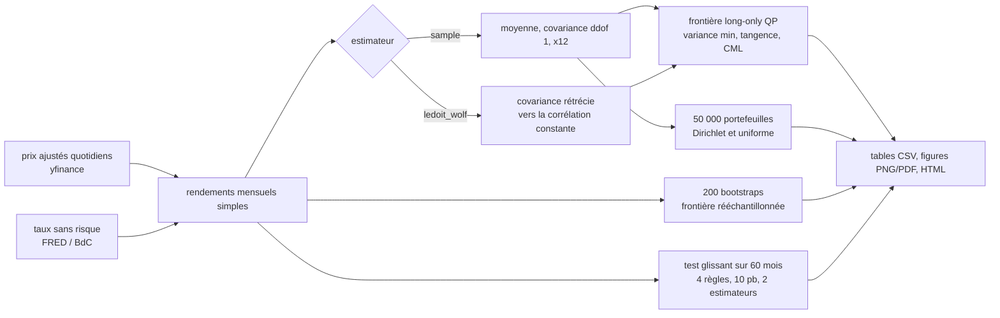

# Méthodes et résultats détaillés

[Retour à la présentation](../README.md). Les périodes restent arrêtées à juillet 2026.

Le [contrôle de l'incertitude par blocs de mois](INFERENCE.md) complète les comparaisons descriptives ci-dessous. Les écarts de Sharpe observés restent tous compatibles avec zéro au niveau nominal de 95 %.

## 2. Papiers et éléments répliqués

| Élément | Référence | Fichier produit | Code |
|---|---|---|---|
| Frontière moyenne-variance long-only, variance minimale | Markowitz (1952) | `results/tables/<univers>/frontier_<est>.csv`, `special_portfolios_<est>.csv` | `frontier.py` : `FrontierSolver`, `efficient_frontier` |
| Frontière sans contrainte de signe, théorème des deux fonds | Merton (1972) | colonne `vol_unconstrained` de `frontier_<est>.csv` | `frontier.py` : `closed_form_frontier` |
| Portefeuille de tangence, droite de marché des capitaux, ratio de Sharpe | Sharpe (1964, 1966) | `special_portfolios_<est>.csv` | `frontier.py` : `FrontierSolver.tangency`, `capital_market_line` |
| Rétrécissement vers la corrélation constante | Ledoit et Wolf (2004) | `moments_ledoit_wolf.csv`, `summary_ledoit_wolf.json` (intensité) | `estimation.py` : `ledoit_wolf_constant_correlation` |
| Frontière rééchantillonnée | Michaud (1998) | `resampled_frontier_<est>.csv` | `montecarlo.py` : `resampled_frontier` |
| Comparaison hors échantillon à 1/N | DeMiguel, Garlappi et Uppal (2009) | `oos_metrics.csv`, `oos_returns.csv` | `backtest.py` : `walk_forward` |
| Diversification maximale (portefeuille de référence supplémentaire) | Choueifaty et Coignard (2008) | `special_portfolios_<est>.csv` | `frontier.py` : `FrontierSolver.max_diversification` |

Ce qui n'est pas répliqué : les tableaux chiffrés de ces papiers (autres univers, autres périodes). Le dépôt
applique leurs méthodes à deux univers de FNB et mesure ce qu'elles donnent.


## 4. Méthode



Choix qui comptent :

1. Moments annualisés par simple produit par 12 (moyenne arithmétique, covariance), sans correction
   d'autocorrélation. Le taux sans risque de la frontière est la moyenne des taux mensuels de la période,
   composée sur l'année.
2. Frontière long-only par programme quadratique (cvxpy, solveur Clarabel), compilé une fois avec des
   paramètres et résolu pour 60 cibles de rendement entre le minimum de variance et l'actif le plus rentable.
   La tangence long-only passe par la transformation de Charnes-Cooper (minimiser y'Σy sous (μ - r)'y = 1,
   y ≥ 0, puis normaliser), qui en fait un QP exact plutôt qu'une recherche non convexe.
3. Deux tirages de poids pour le Monte Carlo : Dirichlet(1, …, 1), définie sous la figure 1, et vecteur
   uniforme normalisé par sa somme, qui se concentre autour de 1/N. Les deux sont vectorisés (un produit
   matriciel et un `einsum`, aucune boucle sur les portefeuilles).
4. Frontière rééchantillonnée : 200 bootstraps i.i.d. des mois, les tirages étant indépendants et identiquement
   distribués, ré-estimation, frontière à 30 rangs, moyenne des poids par rang, statistiques évaluées sous les
   moments d'origine.
5. Test glissant : à chaque fin de mois, moments estimés sur les 60 mois précédents, poids cibles tenus le
   mois suivant, dérive des poids entre deux rééquilibrages, coût de 10 points de base par unité de rotation
   aller simple. Quatre règles : Sharpe maximal, variance minimale, inverse de la volatilité, 1/N ; les deux
   premières sous moments échantillon et sous Ledoit-Wolf. TCAC, le taux de croissance annuel composé, en années
   civiles (jours / 365,25) ; Sharpe sur rendements excédentaires mensuels × √12 ; perte maximale sur la richesse
   cumulée ; rotation annuelle moyenne.


### 5.1 Dans l'échantillon : trois FNB suffisent au portefeuille de tangence

| Univers, estimateur | Portefeuille | Rendement | Volatilité | Sharpe | Poids supérieurs à 0,5 % |
|---|---|---|---|---|---|
| É.-U., échantillon | variance minimale | 3,30 % | 5,41 % | 0,36 | IEF 73,2 %, HYG 14,7 %, DBC 12,1 % |
| É.-U., échantillon | tangence | 9,00 % | 9,49 % | 0,80 | SPY 48,9 %, IEF 26,2 %, GLD 24,9 % |
| É.-U., échantillon | équipondéré | 6,54 % | 10,79 % | 0,48 | 11 × 9,1 % |
| É.-U., Ledoit-Wolf (δ = 0,085) | variance minimale | 3,34 % | 5,56 % | 0,35 | IEF 73,1 %, HYG 16,1 %, DBC 10,8 % |
| É.-U., Ledoit-Wolf (δ = 0,085) | tangence | 9,22 % | 9,90 % | 0,79 | SPY 50,6 %, GLD 25,9 %, IEF 23,6 % |
| Canada, échantillon | variance minimale | 3,00 % | 4,78 % | 0,31 | XBB 95,0 %, XEG 3,8 %, XIN 1,2 % |
| Canada, échantillon | tangence | 11,30 % | 11,51 % | 0,85 | XSP 63,7 %, CGL 18,9 %, XIU 17,4 % |
| Canada, échantillon | équipondéré | 6,90 % | 8,72 % | 0,61 | 11 × 9,1 % |
| Canada, Ledoit-Wolf (δ = 0,203) | variance minimale | 3,06 % | 4,78 % | 0,32 | XBB 62,5 %, XCB 35,3 %, XEG 1,1 %, XHY 0,7 % |
| Canada, Ledoit-Wolf (δ = 0,203) | tangence | 11,27 % | 11,50 % | 0,85 | XSP 57,1 %, XIU 29,7 %, CGL 13,2 % |

Sources : `special_portfolios_<est>.csv` et `summary_<est>.json` dans `results/tables/us/` et `results/tables/canada/`.
Lecture : sur 11 actifs, l'optimiseur n'en garde que trois à la tangence et trois ou quatre au minimum de
variance ; les huit autres ont un poids nul. La contrainte de positivité coûte cher en volatilité. Au rendement
de la tangence américaine (8,98 %), la frontière sans contrainte de signe atteint 6,54 % de volatilité contre 9,46 %
en long-only (`frontier_sample.csv`, colonne `vol_unconstrained`). Ce gain exige des ventes à découvert qu'un
investisseur en FNB ne fait pas.


*Figure 2. Poids le long de la frontière long-only américaine en fonction de la volatilité cible : IEF domine le
bas de la frontière, SPY et GLD le haut. La légende ne liste que les FNB dont le poids dépasse 0,5 % quelque part
sur la frontière ; IWM, EFA, EEM, LQD et VNQ, jamais retenus par l'optimiseur, en sont exclus.*

Comment lire cette figure : chaque bande verticale est un portefeuille de la frontière, les aires empilées sont
ses poids et somment à 100 % ; on lit à volatilité fixée quelles classes composent le portefeuille.

### 5.2 Le nuage Monte Carlo n'atteint jamais les extrémités de la frontière

| Univers, tirage | Meilleur Sharpe simulé | Sharpe de tangence | Vol. min. simulée | Vol. du min. de variance | Rend. max. simulé | Rend. max. de la frontière | Écart médian de vol. à la frontière | Part à moins de 1 pt de la frontière | Part avec un poids ≥ 50 % |
|---|---|---|---|---|---|---|---|---|---|
| É.-U., Dirichlet | 0,73 | 0,80 | 6,06 % | 5,41 % | 10,32 % | 11,89 % | 4,12 pt | 0,06 % | 1,08 % |
| É.-U., uniforme normalisé | 0,68 | 0,80 | 7,22 % | 5,41 % | 9,58 % | 11,89 % | 4,00 pt | 0,00 % | 0,00 % |
| Canada, Dirichlet | 0,82 | 0,85 | 5,34 % | 4,78 % | 10,73 % | 12,94 % | 1,87 pt | 7,89 % | 1,08 % |
| Canada, uniforme normalisé | 0,77 | 0,85 | 6,17 % | 4,78 % | 9,42 % | 12,94 % | 1,82 pt | 3,58 % | 0,00 % |

Source : `montecarlo_summary_sample.csv` (50 000 portefeuilles par ligne, graine 123).
Lecture : la colonne « Meilleur Sharpe simulé » se compare à « Sharpe de tangence », « Vol. min. simulée » à
« Vol. du min. de variance », « Rend. max. simulé » à « Rend. max. de la frontière » ; les trois dernières
colonnes mesurent la distance du nuage à la frontière. Trois constats. 1) Aucun des quatre tirages n'atteint la
frontière : le meilleur des 50 000 portefeuilles reste sous la tangence (0,73 contre 0,80 aux É.-U., 0,82 contre
0,85 au Canada) et aucune volatilité simulée ne descend au minimum de variance (6,06 % contre 5,41 % aux É.-U.).
2) Le tirage uniforme normalisé fait pire que Dirichlet aux deux bouts de la frontière : Sharpe 0,68 contre 0,73
et volatilité minimale 7,22 % contre 6,06 % aux É.-U., aucun portefeuille à moins de 1 point de la frontière ni
avec un poids au-dessus de 50 % ; seul l'écart médian est comparable (4,00 contre 4,12 pt). 3) Le nuage
canadien colle davantage à la frontière (écart médian 1,87 point contre 4,12 ; 7,89 % des tirages à moins de
1 point contre 0,06 %) : l'équipondéré canadien, autour duquel les tirages se concentrent, part moins loin de sa
tangence (Sharpe 0,61 contre 0,85, tableau 5.1) que l'américain (0,48 contre 0,80).

Pourquoi le nuage ne touche pas la frontière. Les extrémités de la frontière sont des portefeuilles concentrés.
Le rendement maximal est un seul FNB (SPY ou XSP.TO à 100 %) ; le minimum de variance met 73 % dans IEF ou 95 %
dans XBB.TO. Or un tirage uniforme sur le simplexe à 11 actifs donne un poids maximal médian de 26,2 % et ne
dépasse 50 % que dans 1,08 % des cas. Le tirage uniforme normalisé est pire : poids maximal médian de 16,7 %,
99e centile à 25,6 %, aucun portefeuille au-dessus de 50 %. Sous Dirichlet(1), la probabilité qu'un poids dépasse
95 % vaut 11 × 0,05^10, soit environ 10^-12 (calcul, non simulé) : il faudrait mille milliards de tirages pour
voir un seul portefeuille proche d'un sommet. C'est pourquoi le nuage reste un ovale au centre du diagramme,
d'autant plus compact que le tirage est normalisé. Aux États-Unis, aucun des 100 000 portefeuilles simulés
n'atteint 0,75 de Sharpe ni ne descend sous 6 % de volatilité ; le QP trouve 0,80 et 5,41 % en 3 millisecondes
(tangence et variance minimale, mesuré). Le Monte Carlo illustre la forme du problème ; il ne le résout pas.


*Figure 3. FNB canadiens, tirage uniforme normalisé : le nuage est plus compact que sous Dirichlet (figure 1) et
s'éloigne davantage de la frontière. XEM.TO, XRB.TO, XHY.TO et ZRE.TO ne reçoivent aucun poids sur la frontière ;
XEG.TO (énergie, 29,2 % de volatilité) n'y entre qu'au minimum de variance (3,8 % au plus).*

Comment lire cette figure : mêmes conventions que la figure 1 ; seul le tirage change (vecteur uniforme normalisé
par sa somme au lieu de Dirichlet), le nuage se resserre autour de l'équipondéré et le vide entre le nuage et la
frontière s'élargit.

### 5.3 La frontière rééchantillonnée diversifie davantage et plafonne plus bas

| Univers (moments échantillon) | Meilleur Sharpe sur la frontière | Actifs au-dessus de 0,5 % à ce point | Rendement maximal atteint |
|---|---|---|---|
| É.-U., analytique (QP) | 0,80 | 3 (SPY, IEF, GLD) | 11,89 % (SPY seul) |
| É.-U., rééchantillonnée (200 bootstraps) | 0,77 | 9 (SPY 44,4 %, GLD 22,8 %, IEF 15,7 %, TLT 7,0 %, LQD 3,2 %, IWM 2,1 %, HYG 2,1 %, VNQ 1,8 %, DBC 0,8 %) | 10,67 % au rang 27 sur 30, puis 10,46 % au dernier rang |
| Canada, analytique (QP) | 0,85 | 3 (XSP, CGL, XIU) | 12,94 % (XSP seul) |
| Canada, rééchantillonnée | 0,80 | 9 (XSP 39,9 %, CGL 15,3 %, XIU 14,3 %, XIN 7,4 %, XBB 6,3 %, ZRE 5,6 %, XCB 4,2 %, XEG 3,9 %, XEM 2,6 %) | 11,15 % |

Sources : `frontier_sample.csv`, `resampled_frontier_sample.csv`.
Lecture : moyenner les poids de 200 frontières bootstrap redonne un poids à neuf actifs sur onze, au prix de
0,03 à 0,05 de Sharpe évalué sous les moments d'origine. Le haut de la frontière rééchantillonnée américaine
rebrousse chemin : le rendement baisse de 10,67 % à 10,46 % entre les rangs 27 et 30. Les bootstraps ne
s'accordent pas sur l'actif le plus rentable, et leur moyenne mélange SPY, GLD, VNQ et IWM (figure 4, droite). Michaud présente ce
repli comme une propriété de la méthode, pas comme un défaut ; il signifie que le portefeuille « rendement
maximal » est celui dont l'estimation est la moins sûre.


*Figure 4. Gauche : frontière analytique (noir) et rééchantillonnée (orange), toutes deux évaluées sous les
moments d'origine. Droite : poids moyens rééchantillonnés le long de la frontière, à comparer à la figure 2.*

Comment lire cette figure : à gauche, les deux frontières sont notées sous les mêmes moments, donc comparables
point à point ; la rééchantillonnée reste sous l'analytique et rebrousse chemin en haut. À droite, même
construction que la figure 2, mais avec les poids moyens des 200 bootstraps : neuf FNB au lieu de trois portent
la frontière.

### 5.4 Ledoit-Wolf déplace peu la frontière et n'aide pas hors échantillon

L'intensité de rétrécissement estimée est de 0,085 avec 223 mois (É.-U.) et de 0,203 avec 187 mois (Canada) :
la covariance échantillon est déplacée de 8,5 % et de 20,3 % vers la cible à corrélation constante (corrélation
moyenne 0,38 aux États-Unis, 0,45 au Canada). Dans l'échantillon, la tangence américaine passe de SPY 48,9 % /
IEF 26,2 % / GLD 24,9 % à SPY 50,6 % / GLD 25,9 % / IEF 23,6 %. La canadienne passe de XSP 63,7 % / CGL 18,9 % /
XIU 17,4 % à XSP 57,1 % / XIU 29,7 % / CGL 13,2 %. Hors échantillon (comparaison hors échantillon du [README](../README.md)), le Sharpe maximal sous
Ledoit-Wolf fait moins bien que sous moments échantillon dans les deux univers : 0,69 contre 0,77 aux États-Unis,
0,57 contre 0,62 au Canada. La variance minimale aussi : 0,20 contre 0,24 et 0,07 contre 0,11. Le rétrécissement
répare la covariance, or ce qui déstabilise le portefeuille de tangence est l'estimation des moyennes, que
Ledoit-Wolf ne touche pas : c'est l'argument de DeMiguel, Garlappi et Uppal (2009).


## 10. Références

```bibtex
@article{markowitz1952,
  author  = {Markowitz, Harry},
  title   = {Portfolio Selection},
  journal = {The Journal of Finance},
  year    = {1952}, volume = {7}, number = {1}, pages = {77--91}, doi = {10.2307/2975974}
}
@article{sharpe1964,
  author  = {Sharpe, William F.},
  title   = {Capital Asset Prices: A Theory of Market Equilibrium under Conditions of Risk},
  journal = {The Journal of Finance},
  year    = {1964}, volume = {19}, number = {3}, pages = {425--442}, doi = {10.2307/2977928}
}
@article{sharpe1966,
  author  = {Sharpe, William F.},
  title   = {Mutual Fund Performance},
  journal = {The Journal of Business},
  year    = {1966}, volume = {39}, number = {1}, pages = {119--138}
}
@article{merton1972,
  author  = {Merton, Robert C.},
  title   = {An Analytic Derivation of the Efficient Portfolio Frontier},
  journal = {Journal of Financial and Quantitative Analysis},
  year    = {1972}, volume = {7}, number = {4}, pages = {1851--1872}, doi = {10.2307/2329621}
}
@article{ledoitwolf2004,
  author  = {Ledoit, Olivier and Wolf, Michael},
  title   = {Honey, I Shrunk the Sample Covariance Matrix},
  journal = {The Journal of Portfolio Management},
  year    = {2004}, volume = {30}, number = {4}, pages = {110--119}, doi = {10.3905/jpm.2004.110}
}
@book{michaud1998,
  author    = {Michaud, Richard O.},
  title     = {Efficient Asset Management: A Practical Guide to Stock Portfolio Optimization and Asset Allocation},
  publisher = {Harvard Business School Press},
  year      = {1998}
}
@article{demiguel2009,
  author  = {DeMiguel, Victor and Garlappi, Lorenzo and Uppal, Raman},
  title   = {Optimal Versus Naive Diversification: How Inefficient is the 1/N Portfolio Strategy?},
  journal = {The Review of Financial Studies},
  year    = {2009}, volume = {22}, number = {5}, pages = {1915--1953}, doi = {10.1093/rfs/hhm075}
}
@article{choueifaty2008,
  author  = {Choueifaty, Yves and Coignard, Yves},
  title   = {Toward Maximum Diversification},
  journal = {The Journal of Portfolio Management},
  year    = {2008}, volume = {35}, number = {1}, pages = {40--51}, doi = {10.3905/JPM.2008.35.1.40}
}
```

Données : Yahoo Finance (prix, usage personnel, non redistribués) ; FRED, Federal Reserve Bank of St. Louis,
série TB3MS ; Banque du Canada, Valet, série TB.CDN.90D.MID. Bibliothèques : cvxpy et Clarabel (QP), numpy,
pandas, scipy, matplotlib, seaborn, plotly, yfinance, pyarrow.
